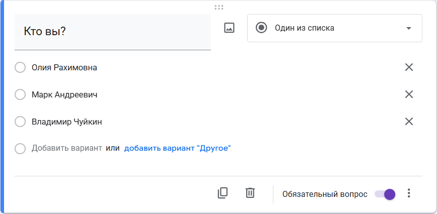
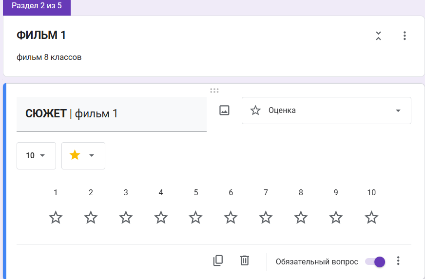
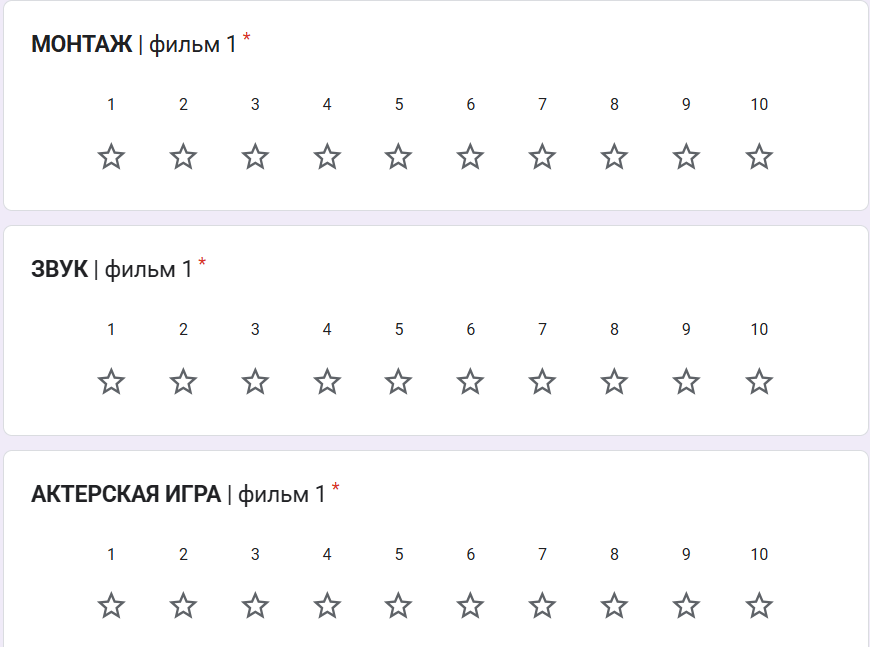

# 🎬 Система анализа оценок кинофестиваля

Проект разработан учениками предуниверсария для автоматизации обработки и визуализации оценок жюри в рамках 4-го кинофестиваля.

## 🎯 Категории оценки
- **АКТЕРСКАЯ ИГРА**
- **ЗВУК** 
- **МОНТАЖ**
- **СЮЖЕТ**

## 📈 Типы визуализаций
- Столбчатые диаграммы средних оценок
- Радарные диаграммы сравнения  
- Круговые диаграммы распределения
- Графики индивидуальных оценок жюри

---

# 📋 Инструкция по работе с проектом

## 1. Создание Google Формы

### Перейдите по ссылке и создайте форму:
https://docs.google.com/forms/

### Настройте структуру формы:

**Первый блок:**
- Добавьте вопрос "Кто вы?" 
- Тип: "Выбор из списка"
- Перечислите всех членов жюри


**Блоки оценок:**
- Для каждого фильма создайте раздел
- Для каждой категории добавьте вопрос в формате:  
  `НАЗВАНИЕ КАТЕГОРИИ | Название фильма`
- Тип вопроса: "Оценка" (шкала 1-10)



## 2. Привязка формы к Google Таблицам
- В форме нажмите "Ответы" → "Создать таблицу"
- Будет автоматически создана связанная таблица

## 3. Настройка Service Account
1. Создайте Service Account в Google Cloud Console
2. Скачайте credentials файл в формате JSON
3. Дайте доступ к таблице для service account email
4. Подробная инструкция: https://habr.com/ru/articles/825404/

## 4. Настройка проекта

### Перенесите файл credentials:
- Поместите скачанный `credentials.json` в корень проекта

### Создайте и заполните файл `.env`:
```env
CREDENTIALS_FILE_NAME='credentials.json'
TABLE_URL='ваша_ссылка_на_таблицу'
WORKSHEET_NAME='Ответы на форму (1)'
```

## 5 Запустите main.py и посмотрите статистику в файле отчет_с_графиками.md